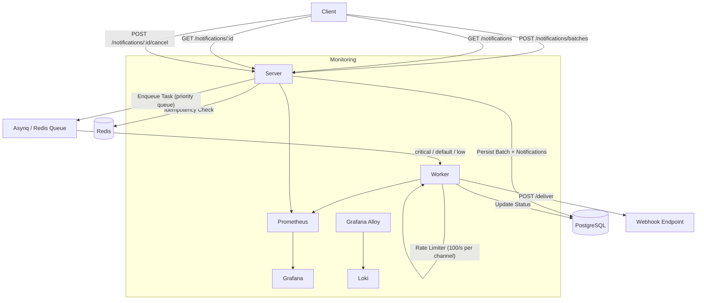

# Notification Service

A Go microservice for dispatching and tracking notifications across SMS, Email, and Push channels. Accepts batches of up to 1,000 notifications via REST API, enqueues them through Asynq (Redis-backed task queue), and delivers them asynchronously to a webhook endpoint with retry logic, rate limiting, and idempotency guarantees.

## Architecture



**Server** (`cmd/server`) — Chi HTTP server handling batch creation, notification queries, and cancellation. Idempotency key is enforced via Redis SETNX before persisting to PostgreSQL.

**Worker** (`cmd/worker`) — Asynq consumer with configurable concurrency (default: 20 goroutines). Tasks are routed into priority queues (`critical` → weight 10, `default` → weight 5, `low` → weight 1). Each channel has an independent rate limiter (100 req/s). Failed deliveries are retried with exponential backoff (max 4 retries, capped at 60s).

**Webhook Delivery** — The worker POSTs `{recipient, channel, content}` JSON to a configurable `WEBHOOK_URL`. 4xx responses are treated as permanent failures; 5xx and network errors trigger retries.

## Prerequisites

- Go 1.26+
- Docker & Docker Compose
- Make (optional, for convenience commands)

## Quick Start

```bash
# Start all services (PostgreSQL, Redis, server, worker, monitoring)
make up

# Or build from source and start
make build
```

Services will be available at:

| Service | URL | Connection         |
|---------|-----|--------------------|
| API Server | http://localhost:8080 | -                  |
| Swagger UI | http://localhost:8080/swagger | -                  |
| Grafana | http://localhost:3000 | -                  |
| Prometheus | http://localhost:9099 | -                  |
| RedisInsight | http://localhost:5540 | redis://redis:6379 |

Wait ~5 seconds after `make up` for health checks to pass.

## API Examples

### Submit a Batch

```bash
curl -X POST http://localhost:8080/api/v1/notifications/batches \
  -H "Content-Type: application/json" \
  -H "Idempotency-Key: $(uuidgen)" \
  -d '{
    "notifications": [
      {
        "recipient": "+905551234567",
        "channel": "sms",
        "content": "Your code is 123456",
        "priority": "high"
      },
      {
        "recipient": "user@example.com",
        "channel": "email",
        "content": "Welcome to our service",
        "priority": "normal"
      },
      {
        "recipient": "device-token-abc123",
        "channel": "push",
        "content": "New message received",
        "priority": "low"
      }
    ]
  }'
```

Response (`202 Accepted`):

```json
{
  "batch_id": "a1b2c3d4-...",
  "status": "accepted",
  "total_count": 3,
  "accepted_at": "2025-01-15T10:30:00Z"
}
```

Replaying the same request with the same `Idempotency-Key` returns the cached original response.

### Query Batch Status

```bash
curl http://localhost:8080/api/v1/batches/{batchId}
```

### List Notifications (with filters)

```bash
curl "http://localhost:8080/api/v1/notifications?status=delivered&channel=sms&page=1&limit=50"
```

Supported query params: `status`, `channel`, `batch_id`, `start_date` (RFC3339), `end_date` (RFC3339), `page`, `limit` (max 100).

### Get a Single Notification

```bash
curl http://localhost:8080/api/v1/notifications/{id}
```

### Cancel a Pending Notification

```bash
curl -X POST http://localhost:8080/api/v1/notifications/{id}/cancel
```

Only notifications in `pending` status can be cancelled.

## Environment Variables

| Variable | Default | Description |
|----------|---------|-------------|
| `DB_HOST` | `localhost` | PostgreSQL host |
| `DB_PORT` | `5432` | PostgreSQL port |
| `DB_USER` | `samil` | PostgreSQL user |
| `DB_PASSWORD` | `mysecretpassword` | PostgreSQL password |
| `DB_NAME` | `myappdb` | PostgreSQL database name |
| `DB_SSLMODE` | `disable` | PostgreSQL SSL mode |
| `REDIS_HOST` | `localhost` | Redis host |
| `REDIS_PORT` | `6379` | Redis port |
| `SERVER_PORT` | `8080` | HTTP server listen port |
| `WEBHOOK_URL` | — | Delivery webhook URL (required for worker) |
| `WORKER_CONCURRENCY` | `20` | Max concurrent worker goroutines |
| `METRICS_PORT` | `9090` | Prometheus metrics listen port (worker) |
| `LOG_LEVEL` | `info` | Log level: `debug`, `info`, `warn`, `error` |

## Performance Tuning

### Worker Concurrency

`WORKER_CONCURRENCY` controls the number of goroutines the Asynq worker runs in parallel. Increase for higher throughput; decrease to reduce resource consumption under light load.

```bash
WORKER_CONCURRENCY=50
```

### Priority Queues

Tasks are routed to queues based on notification priority:

| Priority | Queue | Weight |
|----------|-------|--------|
| `high` | `critical` | 10 |
| `normal` | `default` | 5 |
| `low` | `low` | 1 |

Queue weights are configured in `cmd/worker/main.go:68`. Adjust the weight map to change relative dequeue rates.

### Rate Limiting

Each channel (SMS, Email, Push) has an independent rate limiter set to **100 requests/second** (`internal/worker/processor.go:18`). Modify `rateLimitPerSecond` to match your downstream provider's limits.

### Retry Behavior

- **Max retries**: 4 (`internal/worker/processor.go:19`)
- **Backoff**: Exponential with jitter — `(attempt+1) * 10s + random[0, 2s)`, capped at 60s
- **Permanent failure**: HTTP 4xx from webhook → no retry
- **Temporary failure**: HTTP 5xx / 429 / network error → retry with backoff

### Batch Size

The API accepts up to **1,000 notifications** per batch request. This limit is enforced in `internal/adapter/batch/handler.go:56`.

## Testing

```bash
# Unit tests
make test

# Integration tests (requires Docker services running)
make test-integration

# Load tests (k6, uses Docker profile "load-test")
make test-performance
```

Integration tests use `//go:build integration` tags and require PostgreSQL + Redis. They create a mock webhook server and test the full server → queue → worker pipeline end-to-end.

## Monitoring Stack

Docker Compose includes a full observability stack:

- **Prometheus** — Scrapes server `/metrics`, worker metrics, Redis, PostgreSQL, and node exporters
- **Grafana** — Pre-provisioned dashboards at http://localhost:3000 (anonymous admin access)
- **Loki** — Log aggregation via Grafana Alloy (Docker container log collection)
- **Redis Exporter** — Redis metrics on port 9121
- **PostgreSQL Exporter** — DB metrics on port 9187

### Useful Makefile Commands

```bash
make help             # List all available commands
make up               # Start all services
make down             # Stop all services
make build            # Build and restart services
make logs             # Tail server + worker logs
make db-shell         # Open psql shell
make redis-shell      # Open redis-cli shell
make flush            # Truncate DB tables + flush Redis + clear Loki
make clean            # Full reset: remove all volumes and rebuild
make db-migrate       # Run database migrations (runs on server start)
```

## Developer Notes
### System Design and Philosophy
- This was a focused two-day weekend project. My main goal was to build a system that feels "frictionless"—simple to understand, easy to run, and stable under pressure. I deliberately avoided over-engineering to keep the architecture clean and the development pace high.

### The Toolbox
- **Storage:** I chose PostgreSQL because it’s my comfort zone. It’s reliable, handles filtering perfectly, and allowed me to iterate on the schema quickly.
- **Queue and Caching:** Instead of using in-memory solutions that wouldn't scale, I went with Redis. Using it for both caching and as a message broker (via asynq) kept the infrastructure lean without sacrificing power.
- **Observability:** I used Grafana because I’m familiar with it. While there are lighter tools out there, being able to build detailed dashboards quickly was worth the extra setup.

### Delivery and Processing
- The API is fully asynchronous to keep things snappy. I used idempotency checks and PostgreSQL's COPY command for fast ingestion. On the worker side, asynq handled the heavy lifting for retries and exponential backoff. I also separated the queues by channel so that a bottleneck in one wouldn't bring down the others.

### Testing and Observability
- I prioritized integration and performance tests over unit tests. In a short project where things change fast, I wanted to be sure the entire system worked, rather than just individual functions. The performance tests are particularly useful—you can actually watch the rate limiting and backoff logic happen in real-time on the Grafana dashboards.

### AI Usage
- I used Gemini to brainstorming ideas and divide them into the development phases. The actual implementation was done using the GLM 5.1 model on OpenCode. This workflow was a huge time-saver for the "heavy lifting" parts while generating boilerplate, writing test cases, and configuring dashboards which, let me focus on the actual system architecture.

### Technical Trade-offs
- **Purity vs. Speed:** You might find places where I strayed from strict DDD or SOLID principles. This was a conscious choice to keep things moving.
- **The Outbox:** I didn't build a separate outbox relay. I used the main notifications table to track state, which is "good enough" for the current scope.
- **Testing:** Since I was refactoring constantly, I skipped unit tests to avoid the maintenance overhead, relying instead on system-level validation.

### What’s missing (If I had more time)

- **Resilience:** I'd add circuit breakers for each channel to stop downstream failures from cascading.


- **Stale Recovery:** During heavy load tests, I noticed notifications can occasionally get stuck in "processing" if the service crashes. A cleanup worker to find and re-queue these would be a great addition.


- **Dynamic Config:** Right now, things like rate limits are static. It would be much better to organize them in one place in a way that they could be tuned on the fly.


- **A CLI Toolbox:** A small set of administrative commands for manual patches or bulk status updates would make managing the system much easier.


- **Scheduled Notifications:** Adding this wouldn't have been a massive design challenge. Looking back, it's the one feature I genuinely wish I had included from the start.


- **Template System:** I thought about storing templates as JSONB in PostgreSQL, caching them in Redis, and rendering them on the worker side. I left this out of the scope simply because generating the templates and writing the rendering logic would have consumed too much time.


- **WebSocket Updates:** I struggled to find a truly solid use case for this. I initially considered broadcasting the delivery percentage of batches split by channels, but realized it wouldn't offer much more value than the metrics I was already generating, so I decided to drop the idea.